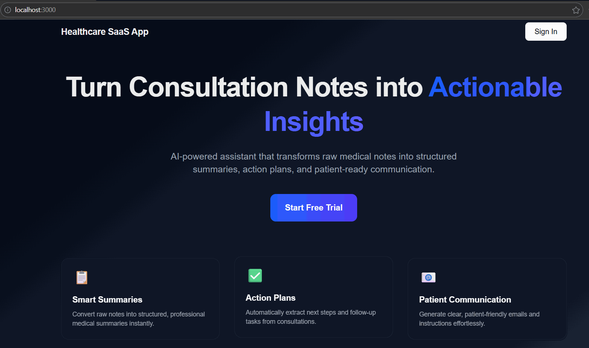

# Healthcare SaaS - Consultation Notes Generator

A full-stack healthcare SaaS application that uses AI to generate consultation summaries and patient emails from doctor's notes. Built with Next.js, FastAPI, AWS App Runner, S3, and CloudFront.

This repository also includes **GitHub Actions CI/CD** for automated AWS deployments. See [`.github.example/workflows/README.md`](.github.example/workflows/README.md).

## Demo



##  Architecture

- **Frontend**: Next.js (React + TypeScript) deployed to S3 + CloudFront
- **Backend**: FastAPI (Python) deployed to AWS App Runner
- **Infrastructure**: Terraform for AWS resources (ECR, App Runner, S3, CloudFront)
- **Authentication**: Clerk
- **AI**: OpenAI GPT 5

##  Prerequisites

- **Node.js** 18+ and npm
- **Python** 3.11+ with `uv` package manager
- **Docker** Desktop 
- **AWS CLI** configured with credentials
- **Terraform** 1.0+
- **PowerShell** 5.1+ (for Windows deployment scripts)

##  Quick Start

### 1. Clone the Repository

```bash
git clone <name of this repo>
cd Healthcare_SaaS_App
```

### 2. Environment Setup

Create a `.env` file in the root directory with the following variables:

```env
# AWS Configuration
AWS_ACCOUNT_ID=your-aws-account-id
DEFAULT_AWS_REGION=eu-west-3

# Clerk Authentication
CLERK_SECRET_KEY=sk_live_...
CLERK_JWKS_URL=https://your-instance.clerk.accounts.dev/.well-known/jwks.json
NEXT_PUBLIC_CLERK_PUBLISHABLE_KEY=pk_live_...

# OpenAI
OPENAI_API_KEY=sk-...

# Optional: Custom API URL (will be auto-set during deployment)
NEXT_PUBLIC_API_URL=https://your-apprunner-url
```

### 3. Frontend Setup

```bash
cd frontend
npm install
npm run dev  # Development server on http://localhost:3000
```

### 4. Backend Setup

```bash
cd backend
uv sync
uv run uvicorn server:app --reload  # Development server on http://localhost:8000
```

##  Local Development with Docker

### Backend

```powershell
# Load environment variables
Get-Content .env | ForEach-Object {
    if ($_ -match '^(.+?)=(.+)$') {
        [System.Environment]::SetEnvironmentVariable($matches[1], $matches[2])
    }
}

# Build and run
docker build -t consultation-app:latest backend/
docker run -p 8000:8000 --env-file .env consultation-app:latest
```

## ☁️ AWS Deployment

### Prerequisites

1. AWS CLI configured: `aws configure`
2. Environment variables loaded from `.env`

### Deploy Everything

```powershell
# Load environment variables
Get-Content .env | ForEach-Object {
    if ($_ -match '^(.+?)=(.+)$') {
        [System.Environment]::SetEnvironmentVariable($matches[1], $matches[2])
    }
}

# Deploy backend + frontend
cd scripts
.\deploy.ps1 -Environment dev
```

The script will:
1. Create/update ECR repository
2. Build and push Docker image
3. Deploy App Runner service
4. Build Next.js frontend
5. Upload to S3
6. Create CloudFront distribution
7. Display deployment URLs

### Destroy Infrastructure

```powershell
cd scripts
.\destroy.ps1 -Environment dev
```

## 📁 Project Structure

```
healthcare-saas/
├── backend/              # FastAPI backend
│   ├── server.py        # Main API server
│   ├── Dockerfile       # Container definition
│   └── requirements.txt # Python dependencies
├── frontend/            # Next.js frontend
│   ├── pages/          # Next.js pages
│   ├── styles/         # Global styles
│   └── public/         # Static assets
├── infra/              # Terraform infrastructure
│   ├── ecr             # Defines ECR repositories for backend container image
│   ├── apprunner       # Configures AWS App Runner services (backend deployment)
│   └── frontend        # Manages S3 bucket + CloudFront distribution for frontend hosting
└── scripts/            # Deployment scripts
    ├── deploy.ps1     # Full deployment script
    └── destroy.ps1    # Infrastructure cleanup
```

## 🔧 Configuration

### Environment Variables

**Backend (App Runner):**
- `CLERK_SECRET_KEY`: Clerk secret key for JWT verification
- `CLERK_JWKS_URL`: Clerk JWKS endpoint URL
- `OPENAI_API_KEY`: OpenAI API key for AI processing

**Frontend (Build-time):**
- `NEXT_PUBLIC_CLERK_PUBLISHABLE_KEY`: Clerk publishable key
- `NEXT_PUBLIC_API_URL`: Backend API URL (auto-set during deployment)


##  Testing

### Backend Health Check

```bash
curl https://your-apprunner-url/health
```

### Frontend

Visit your CloudFront distribution URL to access the application.

##  API Endpoints

- `POST /api/consultation` - Generate consultation summary (requires auth)
- `GET /health` - Health check endpoint

##  Security

- Authentication handled by Clerk
- JWT tokens validated on backend
- Environment variables stored securely in App Runner
- S3 bucket is private (accessible only via CloudFront)

##  Troubleshooting

### Deployment Issues

1. **Docker push fails**: Check AWS credentials and ECR permissions
2. **App Runner CREATE_FAILED**: Verify image exists in ECR and health check endpoint works
3. **Frontend can't connect**: Check `NEXT_PUBLIC_API_URL` is set correctly

### Common Issues

- **CORS errors**: Ensure CloudFront domain is allowed in CORS settings
- **Authentication fails**: Verify Clerk keys are production keys (pk_live_/sk_live_)
- **Build errors**: Check Node.js and Python versions match requirements

##  CI/CD with GitHub Actions

This project includes GitHub Actions workflows for automatic deployment.

### Setup

See [.github.example/workflows/README.md](.github.example/workflows/README.md) for detailed setup instructions.

## 📄 License

MIT License